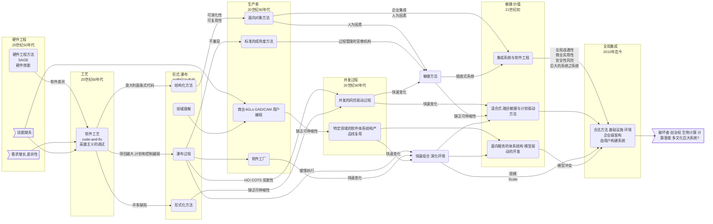

# DevOps

## 软件工程

  + 软件工程发展趋势

 

## DevOps概述

$$\begin{gather*}
  \begin{drcases}
  \text{敏捷} \\
  \text{精益}
  \end{drcases}
  \to DevOps
  \begin{dcases}
  \text{价值观} \\
  \text{原则} \\
  \text{方法} \\
  \text{实践} \\
  \text{工具}
  \end{dcases} \\
  \begin{drcases}
  \text{敏捷价值观} \\
  \text{精益价值观}
  \end{drcases}
  \to DevOps \text{价值观} \\
  \begin{drcases}
  \text{敏捷原则} \\
  \text{精益原则}
  \end{drcases}
  \to DevOps \text{原则} \\
  \end{gather*}$$
  + 价值观
    + $$\begin{align*}
        \text{个体和互动} & > \text{流程和工具} \\
        \text{工作的系统} & > \text{详尽的文档} \\
        \text{客户以及程序员合作} & > \text{合同谈判} \\
        \text{响应变化} & > \text{遵循计划} 
        \end{align*}$$
  + ~~原则~~
  + 方法
    + $$\begin{gather*}
        DevOps \text{方法} \gets \text{敏捷方法}
        \begin{dcases}
        Scrum & \text{迭代式增量软件开发过程} \\
        XP & \text{极限编程} \\
        Kanban & \text{看板} \\
        \cdots
        \end{dcases}
        \end{gather*}$$ 
  + 实践
    + $$\begin{gather*}
        DevOps \text{实践}
        \begin{dcases}
        \cancel{\text{管理实践}} \\
        \text{技术实践}
        \end{dcases}
        \end{gather*}$$ 
  + **工具**

 

## DevOps研究现状

$$\begin{gather*}
  DevOps \xrightarrow{\text{支持}}
  \begin{dcases}
  \text{微服务} \\
  \text{容器} \\
  \text{持续集成} \\
  \text{持续交付} \\
  \cdots
  \end{dcases}
  \end{gather*}$$ 

 

## DevOps流程

$$\begin{gather*}
  \text{需求} \to \text{计划} \to \overbrace{\overbrace{\text{开发} \to \text{构建} \to \text{测试}}^{集成} \to \text{发布}}^{DevOps\text{核心流程}} \to \text{运营} \\
  \begin{align*}
  \text{开发} &
  \begin{dcases}
  \text{协同开发工具} \\
  \text{版本管理工具} \\
  \text{编译工具} \\
  \text{单元测试工具}
  \end{dcases} \\
  \text{测试} & \ \text{自动化测试工具} \\
  \text{集成} & \ \text{持续集成工具} \\
  \text{发布} & \ \text{配置管理工具} \\
  \text{运营} & \ \text{监控工具}
  \end{align*} 
  \end{gather*}$$
  
 

## DevOps工具集

+ 协同开发工具
  + JIRA
  + Kanboard
  + Rally
+ 版本管理工具
  + Git
  + GitHub
  + GitLab
  + Subversion
  + Mercurial
+ 编译工具
  + Ant
  + Maven
  + Gradle
  + MSBuild
+ 单元测试工具
  + JUnit
+ 自动化测试工具
  + Selenium
  + Cucumber
  + FitNesse
+ 持续集成工具
  + Jenkins
  + Bamboo
  + Travis CI
+ 配置管理工具
  + Chef
  + Puppet
  + Ansible
+ 监控工具
  + Nagios
  + Zabbix
